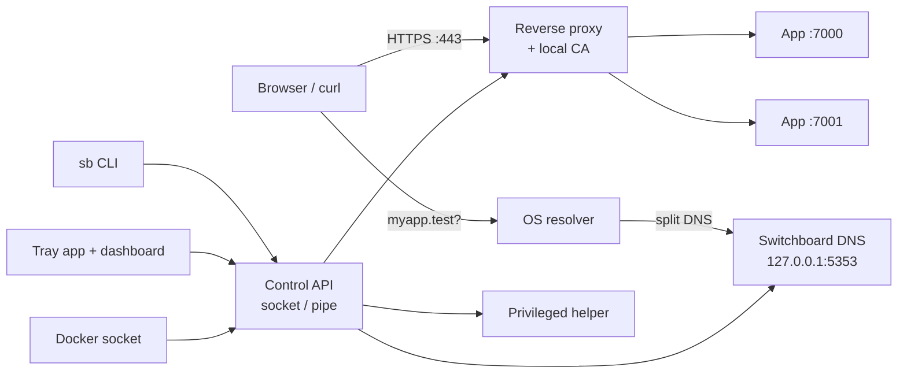

# Product Spec: Switchboard (working name)

Sep 25, 2026 · @Nana Aikinson

## Overview

Switchboard gives every local app a stable, trusted HTTPS name: `localhost:7000` becomes `https://myapp.test`, and `api.myapp.test` can point at a second app. It runs as a small background service with a CLI, a web dashboard and a tray app, on macOS, Linux and Windows.

**Problem.** Developers juggle `localhost:3000`, `:5173`, `:8080`. Ports collide, cookies and CORS behave differently than production, OAuth callbacks break when ports change, and some browser APIs need HTTPS. Existing tools cover pieces: OrbStack is macOS and Docker only, Portless and localias are CLI-only, puma-dev targets Ruby.

**One-line pitch.** Named, trusted HTTPS URLs for every local app and container, set up in one command or one click, on any OS.

**Goals**

- Map a name (and any subdomain) to a local port in under 10 seconds.
- Trusted HTTPS with no browser warnings, including WebSockets and dev-server hot reload.
- Zero-config Docker containers get names automatically.
- Install through `curl | sh`, Homebrew, or a signed `.dmg` / `.exe`.
- Full, clean uninstall that reverts every system change.

**Non-goals (v1)**

- Public tunnels or sharing to the internet (users can pair with ngrok or Tailscale).
- Running or supervising app processes (considered post-1.0).
- Production reverse proxy use.
- Routing non-HTTP protocols by hostname (post-1.0, via per-app loopback IPs).

## Users and use cases

The primary user is a web developer running two or more local services at once. Secondary users are teams that want everyone on the same local URLs.

| Persona | Situation | What they need |
| --- | --- | --- |
| Full-stack developer | Frontend on :5173, API on :8000, admin on :3001 | `app.test`, `api.app.test`, `admin.app.test` with shared cookies |
| Multi-tenant SaaS developer | Tenant chosen by subdomain | Wildcard `*.app.test` to one port |
| Docker Compose user | Many containers, messy port forwards | Automatic `service.project.test` names |
| OAuth / payments integrator | Callback URLs must be stable and HTTPS | Fixed HTTPS name that survives port changes |
| Team lead | Onboarding friction, inconsistent setups | A committed config file everyone applies |
| Non-CLI developer | Prefers GUI tools | Add, toggle and open routes from a tray app |

**Core user stories**

1. As a developer, I run `sb add myapp 7000` and open `https://myapp.test` immediately.
2. As a developer, I run `sb add api.myapp 7001` and the subdomain routes to a different app.
3. As a developer, I add `*.myapp` so every subdomain reaches one port.
4. As a Docker user, I start a Compose project and see its services listed with working URLs.
5. As a GUI user, I open the tray menu, see all routes with live status, and click one to open it.
6. As any user, I run `sb doctor` and get a plain explanation of what is broken and how to fix it.
7. As any user, I run `sb uninstall` and my machine is exactly as it was.

## Domain strategy

The default top-level domain is `.test`; users can switch it or add others. `.local` is supported only as an opt-in mode, because it is reserved for multicast DNS and breaks unpredictably through normal DNS (OrbStack users report exactly this in [issue #2274](https://github.com/orbstack/orbstack/issues/2274)).

| TLD | How it resolves | Pros | Cons | Status |
| --- | --- | --- | --- | --- |
| `.test` | Switchboard's DNS server via OS split-DNS | Reserved, never public, full control, wildcards work | Needs one-time admin setup | Default |
| `.localhost` | Browsers map it to loopback natively | Works in browsers with no DNS setup | Some CLI tools and runtimes don't resolve it | Supported |
| `.internal` | Switchboard's DNS server | Reserved for private use | Some corporate networks already use it | Supported |
| `.local` | mDNS announcement per registered name (Bonjour / Avahi) | Familiar, OrbStack-like | No wildcards over mDNS; ISP or corporate DNS can hijack it; slower lookups | Opt-in, marked experimental |
| Custom (e.g. `.dev.acme`) | Switchboard's DNS server | Team branding | Risk of colliding with real domains | Opt-in with warning |

Rules:

- Reject public suffixes that exist on the internet (`.dev`, `.app`, `.com`) unless the user passes `--force`.
- In `.local` mode, wildcards are emulated by announcing each registered subdomain explicitly.
- Changing the TLD re-issues certificates and rewrites resolver config in one step.

## Coexistence with other tools

Switchboard never takes over a domain or port another tool already owns; it detects the tool and picks one of three coexistence modes, defaulting to a separate domain on a separate loopback address.

Two tools collide in three places. The split-DNS file (`/etc/resolver/test` on macOS) allows one owner per domain, so the last installer wins. Ports 80/443 on an address allow one listener, which receives every request for that domain; this is the real conflict. Local CAs don't conflict, since several can be trusted at once.

**Detection (P0)**

- `sb setup` and `sb doctor` check for a resolver file for the chosen TLD not written by Switchboard, and name the process holding 80/443.
- Known tools are recognized by name and config path: Laravel Herd, Laravel Valet, puma-dev, Portless, localias, DDEV, Lando.
- On a conflict, setup stops, explains what it found, and offers the modes below. It never overwrites another tool's files.

| Mode | How it works | Pros | Cons | Priority |
| --- | --- | --- | --- | --- |
| 1. Separate domain + loopback IP (default) | Use a TLD the other tool doesn't claim (e.g. `.localhost`, `.internal`); DNS answers `127.0.0.2`; proxy binds `127.0.0.2:80/443` | Tools never interact; survives the other tool's updates | Different TLD from the other tool; fails if the other tool binds all addresses on 80/443 (OS-dependent) | P0 |
| 2. Shared domain, Switchboard in front | Switchboard's DNS answers its names and forwards other names under the TLD to the other tool's DNS; the other tool's web server moves to alternate ports and Switchboard forwards unknown hosts to it | One TLD for everything | Fragile: the other tool's updates may reclaim 80/443 | P2 |
| 3. Adapter | No Switchboard proxy; routes are registered in the other tool, e.g. `herd proxy <name> http://127.0.0.1:<port> --secure` or `valet proxy` | Zero conflict; Switchboard acts as UI and CLI on top | Limited to what the other tool supports; no Docker discovery through it | P1 |

**Requirements**

- P0: macOS helper adds loopback aliases (`127.0.0.2` and up) and removes them on uninstall; Linux needs no alias.
- P0: Every system change is recorded in a state file with a content hash; uninstall removes only entries still matching, and reports any it skipped.
- P1: Adapter mode for Herd and Valet, selected automatically when the user chooses to share their TLD.
- P1: `sb doctor` re-checks for conflicts after OS or other-tool updates.

## Functional requirements

Requirements are tagged P0 (v0.1–v0.2), P1 (before v1.0) or P2 (after v1.0).

### Daemon

- P0: Runs as a user-level background service, starts at login, restarts on crash.
- P0: Holds the route table; persists it to `~/.config/switchboard/routes.toml` (Windows: `%APPDATA%`).
- P0: Exposes a versioned control API over a Unix socket / Windows named pipe; the CLI and GUI are clients.
- P0: Hot-reloads routes with no dropped connections.
- P1: Health-checks each upstream port and reports up / down / unknown.
- P1: Streams events (route added, upstream down) to clients.

### Privileged helper

- P0: Installed once with admin rights; does only four things: bind 80/443, write split-DNS config, install the CA in trust stores, and undo all of that.
- P0: Accepts commands only from the daemon, authenticated by socket permissions.
- P0: macOS launchd daemon, Windows service, Linux systemd unit.

### DNS

- P0: Built-in DNS server on `127.0.0.1:5353` answering `*.<tld>` with `127.0.0.1` and `::1`.
- P0: Split-DNS registration: `/etc/resolver/<tld>` (macOS), systemd-resolved drop-in (Linux), NRPT rule (Windows).
- P1: Hosts-file fallback for systems without split-DNS, exact names only.
- P1: mDNS announcer for `.local` mode.

### Reverse proxy

- P0: Listens on 80 and 443 (loopback only by default); routes by `Host` header to `127.0.0.1:<port>`.
- P0: Exact names, subdomains, and wildcard patterns (`*.myapp.test`); most specific match wins.
- P0: WebSockets and HTTP/2; long-lived connections for dev-server hot reload.
- P0: HTTP → HTTPS redirect (toggle per route).
- P0: Sets `X-Forwarded-Proto`, `X-Forwarded-Host`, `X-Forwarded-For`.
- P1: Path-based routes (`myapp.test/api` → :8000).
- P1: Friendly error page when the upstream is down, with the port and a start hint.
- P2: LAN mode binding to network interfaces, off by default.

### TLS

- P0: Generates a local root CA on first run, name-constrained to the configured TLDs.
- P0: Installs it in macOS Keychain, Windows cert store, Linux CA bundle, and Firefox NSS stores.
- P0: Issues leaf certificates on demand, including wildcard certs per subdomain level.
- P1: `sb trust` / `sb untrust`; CA rotation.

### CLI (`sb`)

| Command | Purpose | Priority |
| --- | --- | --- |
| `sb setup` | One-time privileged install (helper, DNS, CA) | P0 |
| `sb add <name> <port>` | Create route; `--https-upstream`, `--no-redirect` | P0 |
| `sb rm <name>` | Delete route | P0 |
| `sb ls` | List routes with status; `--json` | P0 |
| `sb open <name>` | Open in browser | P0 |
| `sb doctor` | Diagnose DNS, ports, certs, conflicts | P0 |
| `sb uninstall` | Revert every system change | P0 |
| `sb tld set/add` | Manage TLDs | P1 |
| `sb apply [file]` | Apply project `switchboard.toml` | P1 |
| `sb logs` | Tail proxy logs per route | P1 |
| `sb self-update` | Update when not installed by a package manager | P1 |
| `sb diag` | Export a redacted diagnostic bundle | P1 |
| `sb run -- <cmd>` | Start a process on a free port and route it | P2 |

### GUI

- P1: Web dashboard served at `https://switchboard.test`: route list, add/edit/delete, status, logs.
- P1: Tray / menu-bar app: route list with status dots, click to open, add route, pause all, update notice.
- P1: First-run wizard that explains and triggers the admin prompt.
- P2: Request inspector (recent requests per route).

### Docker integration

- P1: Watches the Docker socket; auto-registers `container.<tld>` and `service.project.<tld>` for Compose.
- P1: Picks the port from the published ports; override with label `dev.switchboard.port=8080`.
- P1: Label `dev.switchboard.hosts=a.test,b.test` for custom names; `dev.switchboard.enable=false` to skip.
- P1: Works with Docker Desktop, OrbStack, Colima, Podman sockets.

### Project config (P1)

```
# switchboard.toml (committed to a repo)
[routes]
"myapp" = 3000
"api.myapp" = 8000
"*.tenants.myapp" = 3000
```

## Architecture and tech stack

One Go binary provides the daemon, CLI and helper modes; the tray app is a separate Tauri shell that talks to the same control API.



The browser asks the OS for the name, the OS forwards only the Switchboard TLD to the local DNS server, and the proxy maps the `Host` header to a port.

| Layer | Choice | Why |
| --- | --- | --- |
| Daemon, CLI, helper | Go, single static binary | Cross-compiles to all targets; strong networking stdlib |
| CLI framework | `spf13/cobra` | Standard, shell completions for free |
| DNS server | `miekg/dns` | Mature, used widely in Go DNS tooling |
| Proxy + TLS | Go standard library: `net/http/httputil.ReverseProxy` + own cert issuer (`crypto/x509`), behind a Proxy interface; embedded Caddy is the fallback | Covers WebSockets, HTTP/2, streaming; full control of error pages, logs and events; small binary. Switch to Caddy only if HTTP/3 or advanced matchers are needed |
| Trust store install | `smallstep/truststore` | Cross-platform CA install incl. NSS |
| mDNS | `hashicorp/mdns` or native Bonjour/Avahi calls | For `.local` mode only |
| Docker | Official Docker Go SDK | Event stream + inspect |
| Control API | JSON over HTTP on a Unix socket / named pipe, versioned `/v1` | Easy for CLI, GUI, and scripts |
| Config | TOML | Readable, commit-friendly |
| Dashboard | Svelte or React, embedded into the Go binary | One artifact, served by the daemon |
| Tray app | Tauri v2 | Tray, signed bundles, built-in updater; reuses dashboard UI |
| Build / release | GoReleaser, nfpm, Tauri bundler, GitHub Actions | Automates binaries, packages, taps, checksums |
| Docs site | Astro Starlight or Docusaurus | Static, versioned docs |

Repository layout (monorepo):

```
cmd/sb/            # entrypoint: daemon | cli | helper modes
internal/dns/      internal/proxy/    internal/pki/
internal/platform/ # darwin, linux, windows implementations
internal/api/      internal/docker/   internal/config/
ui/dashboard/      # web UI, embedded at build time
app/tray/          # Tauri shell
install/           # install.sh, install.ps1
docs/
```

## Platform support

macOS ships first, Linux second, Windows third; each OS needs its own DNS, service and trust-store code.

| Platform | Min version | Arch | Split DNS | Service manager | Trust store | Target release |
| --- | --- | --- | --- | --- | --- | --- |
| macOS | 13 Ventura | arm64, amd64 | `/etc/resolver/<tld>` | launchd (`SMAppService` from the app) | Keychain | v0.1 |
| Linux (Ubuntu, Fedora, Arch) | systemd 246+ | amd64, arm64 | systemd-resolved drop-in; NetworkManager + dnsmasq fallback | systemd | distro CA bundle + NSS | v0.3 |
| Windows | 10 22H2, 11 | amd64, arm64 | NRPT rule | Windows service | Cert store (LocalMachine\\Root) | v0.5 |
| WSL2 | Windows 11 | amd64 | Via Windows host | Windows side | Windows + distro | v1.0 (docs) |

Open issue: Windows NRPT expects a DNS server on port 53, so the Windows build binds `127.0.0.1:53` through the helper.

## Installation and distribution

Every channel installs the same signed binaries from GitHub Releases, then runs `sb setup` for the one admin step.

| Channel | Command / artifact | Contents | Signing | Release |
| --- | --- | --- | --- | --- |
| Install script (macOS, Linux) | `curl -fsSL https://get.switchboard.dev \| sh` | CLI + daemon | SHA256 + minisign signature verified by script | v0.1 |
| Install script (Windows) | `irm https://get.switchboard.dev/win \| iex` | CLI + daemon | Authenticode | v0.5 |
| Homebrew formula (own tap) | `brew install switchboard/tap/sb` | CLI + daemon | Bottle checksums | v0.1 |
| Homebrew cask | `brew install --cask switchboard` | Tray app bundling CLI | Developer ID + notarized | v0.4 |
| macOS `.dmg` | Download from site | Tray app bundling CLI | Developer ID + notarized | v0.4 |
| Windows installer | `.msi` or NSIS `.exe` | Tray app + service + CLI | Authenticode (see note) | v0.5 |
| winget / Scoop | `winget install Switchboard.Switchboard` | CLI or app | Authenticode | v0.5 |
| Linux packages | `.deb`, `.rpm`, AUR | CLI + daemon + systemd unit | GPG-signed repo | v0.3 |

**Install script requirements**

- Detect OS and architecture; refuse unsupported combinations with a clear message.
- Download over HTTPS, verify checksum and signature before writing anything.
- Install to `~/.local/bin` without sudo, or `/usr/local/bin` with `--global`.
- Print exactly what `sb setup` will change before asking for admin rights.
- Idempotent: re-running upgrades in place.

**Signing costs and prerequisites**

- Apple Developer Program: $99/year, needed for Developer ID signing and notarization.
- Windows: Microsoft [Artifact Signing](https://learn.microsoft.com/en-us/azure/artifact-signing/quickstart) is $9.99/month but limits individual developers to the US and Canada. Budget for a certificate-authority code-signing certificate with cloud signing instead, or sign through an entity registered in an eligible country.
- Linux repo: a GPG key kept in CI secrets.

The tray app bundles the CLI and offers "Install command-line tool" on first run, so `.dmg` / `.exe` users get `sb` too.

## Updates and release process

Releases follow semver with stable and beta channels; each install method updates through its own mechanism, and the daemon API stays backward compatible within a major version.

**Versioning and cadence**

- Semver. Before 1.0, minor versions may break config; each break ships a migration.
- Beta channel: every merge to `main` that passes CI, tagged `vX.Y.Z-beta.N`.
- Stable: every 2–4 weeks, plus patch releases for regressions and security fixes.
- Conventional commits; changelog and version bumps generated by release-please.

**Update paths**

| Installed via | Update mechanism | Notes |
| --- | --- | --- |
| Homebrew | `brew upgrade` | `sb self-update` detects Homebrew and defers to it |
| Install script | `sb self-update` or re-run script | Verifies minisign signature, swaps binary atomically, restarts daemon |
| Tray app (.dmg / .exe) | Tauri updater, signed JSON manifest | Updates app, bundled CLI and daemon together |
| winget / Scoop / apt / dnf | Package manager | Self-update disabled |

**Rollout**

1. Tag release; CI builds, signs, notarizes and uploads all artifacts.
2. Publish to beta channel manifest.
3. Promote to stable manifest at 10% of clients (hash of install ID), then 50%, then 100% over about 3 days.
4. Watch crash reports and issue volume at each step; halt by editing the manifest.
5. Homebrew, winget and Linux repos update at 100%.

**Safety rules**

- Keep the previous binary; `sb rollback` restores it.
- Config files carry `schema_version`; the daemon migrates forward and backs up the old file.
- The control API is versioned (`/v1`); a newer client talking to an older daemon shows "restart to update" instead of failing.
- The privileged helper has its own version; it is only reinstalled (with an admin prompt) when its protocol changes.
- Update checks send only version, OS and arch; users can turn them off.

## Security and privacy

The local CA and the privileged helper are the two assets an attacker would want, so both are minimized and locked down.

| Risk | Mitigation |
| --- | --- |
| Stolen CA key used to impersonate real sites | X.509 name constraints limit the CA to configured TLDs; key file mode 0600, stored in OS keychain where available |
| Helper abused for privilege escalation | Helper exposes 4 fixed operations, validates every argument, accepts only the daemon's socket |
| Other devices reach local apps | Proxy and DNS bind loopback only; LAN mode is explicit opt-in with a warning |
| DNS rebinding against local apps | Only configured TLDs resolve; proxy rejects unknown `Host` headers |
| Tampered downloads or updates | Signed binaries, minisign-signed manifests, checksums verified before install |
| Supply chain | Pinned dependencies, `govulncheck` in CI, SBOM published per release, reproducible builds as a v1.0 goal |
| Leftover system changes | `sb uninstall` reverts resolver files, CA trust, services; tested in CI on every OS |

**Privacy**

- No telemetry by default. Opt-in anonymous usage stats and crash reports (Sentry or self-hosted GlitchTip) after v0.4.
- Diagnostic bundles redact hostnames on request and are only sent by the user.
- A `SECURITY.md` with a private reporting address and a 90-day disclosure policy ships in v0.1.

## Roadmap

Six milestones take the project from a macOS CLI to a signed cross-platform 1.0 in roughly 7–9 months of part-time work. Durations assume one developer at about 15 hours a week.

| Milestone | Duration | Scope | Exit criteria |
| --- | --- | --- | --- |
| v0.1 — macOS CLI | 4 weeks | Daemon, helper, DNS, HTTP proxy, subdomains, wildcards, `add/rm/ls/open/doctor/uninstall`, install script, Homebrew tap | 10 outside testers route 2+ apps; uninstall leaves no trace on a clean VM |
| v0.2 — HTTPS | 3 weeks | Local CA, trust install, HTTP/2, WebSockets, redirects, start at login | Next.js, Vite and Rails hot reload work over HTTPS in Chrome, Safari, Firefox |
| v0.3 — Linux + Docker | 5 weeks | systemd-resolved, `.deb/.rpm`, Docker auto-discovery, labels, `switchboard.toml` | CI e2e passes on Ubuntu, Fedora; Compose example routes with no config |
| v0.4 — GUI | 6 weeks | Dashboard, Tauri tray app, signed + notarized `.dmg`, cask, auto-updater, beta channel, opt-in crash reports | First-run wizard completed by 5 non-CLI testers without help |
| v0.5 — Windows | 6 weeks | Service, NRPT, cert store, signed installer, winget, Scoop, PowerShell installer | Same e2e suite green on Windows 11 |
| v1.0 — Stable | 4 weeks | Frozen config and API, docs site, security review of helper and CA, `.local` mDNS mode (experimental) | 30 days with no P0 bugs on beta; docs cover every command |
| Post-1.0 | ongoing | `sb run`, path routing, LAN mode, request inspector, per-app loopback IPs for TCP, team features | Driven by user feedback |

**Launch plan**

- v0.1: announce to a small group (friends, local dev communities) for hands-on feedback.
- v0.4: public launch with a demo video; post to Hacker News, Reddit r/webdev, Product Hunt.
- v1.0: second launch focused on Windows support and stability.

## Metrics, risks and open questions

**Success metrics (6 months after v0.4)**

| Metric | Target | Source |
| --- | --- | --- |
| Time from install to first working URL | Under 2 minutes (median) | Tester sessions, opt-in stats |
| Setup success rate | 95% of `sb setup` runs complete | Opt-in stats |
| Weekly active installs | 2,000 | Update-check pings (version, OS only) |
| GitHub stars | 3,000 | GitHub |
| Open P0 bugs | 0 older than 7 days | Issue tracker |

**Risks**

| Risk | Impact | Mitigation |
| --- | --- | --- |
| Crowded space (Portless, localias, OrbStack) | Low adoption | Lead on GUI, native installers, Windows, Docker |
| OS updates break DNS or trust behavior | Broken installs after macOS/Windows upgrades | Test on OS betas; `doctor` detects and repairs |
| Code-signing access blocked by region | Windows SmartScreen warnings | Buy a CA certificate early; launch Windows later if needed |
| Port 80/443 already used (Apache, IIS, other tools) | Setup fails | Detect in `doctor`; offer alternate ports or show the conflicting process |
| VPNs and corporate DNS override split DNS | Names stop resolving | Hosts-file fallback; document known VPN clients |
| Solo-maintainer burnout | Stalled project | Tight scope, automation, clear contribution guide |

**Open questions**

- [ ] Final product name and CLI command (`sb` is a placeholder).
- [ ] Default TLD: `.test` or `.localhost`?
- [x] Proxy: decided — Go standard library with own cert issuer; Caddy kept as fallback.
- [ ] License: MIT/Apache-2.0, or open core with a paid tray app or team features?
- [ ] Monetization, if any: one-time license for the GUI, or sponsorship only?
- [ ] Which company or entity will hold the Apple and Windows signing identities?
